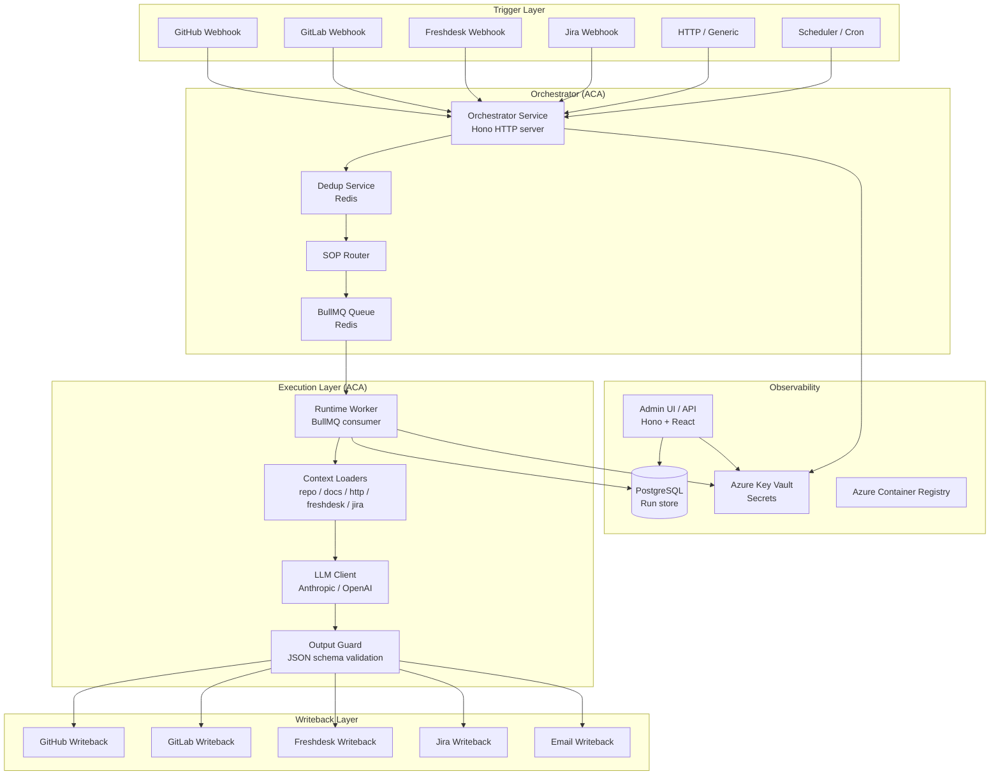

# Via Unita AI Orchestration Layer

An event-driven AI automation platform that routes webhook events from GitHub, GitLab, Freshdesk, Jira, and other sources through configurable Standard Operating Procedures (SOPs), executes LLM prompts, and writes results back to external systems — all without human intervention.

---

## Architecture



---

## Quick Start

```bash
# 1. Clone and install dependencies
git clone https://github.com/your-org/via-unita-orchestration.git
cd via-unita-orchestration
pnpm install

# 2. Configure your tenant
cp config/config.example.yaml config/config.yaml
# Edit config/config.yaml with your credentials and adapter settings

# 3. Deploy to Azure
./infra/scripts/deploy.sh \
  --tenant-id     your-company \
  --environment   dev \
  --location      westeurope \
  --subscription  <your-subscription-id> \
  --acr-name      yourcompanydevacr \
  --api-key       $(openssl rand -hex 32) \
  --anthropic-key sk-ant-...
```

For a complete walkthrough, see [docs/onboarding.md](docs/onboarding.md).

---

## Prerequisites

| Tool | Minimum Version | Notes |
|------|----------------|-------|
| Azure CLI | 2.57 | `az --version` |
| Docker Desktop | 4.x | Required for image builds |
| pnpm | 9.15 | `pnpm --version` |
| Node.js | 22 | LTS recommended |
| jq | 1.6 | Used by deploy scripts |

---

## Package Overview

| Package | Path | Description |
|---------|------|-------------|
| `@vu/core` | `packages/core` | Shared types: `OrchestratorEvent`, `SopDefinition`, `TriggerAdapter`, `WritebackAdapter`, `ContextLoader` |
| `@vu/adapters` | `packages/adapters` | Trigger adapters (GitHub, GitLab, Freshdesk, Jira, HTTP, Schedule) and writeback adapters (GitHub, GitLab, Freshdesk, Jira, Email) |
| `@vu/orchestrator` | `packages/orchestrator` | Hono HTTP server: webhook ingestion, SOP routing, BullMQ dispatch |
| `@vu/runtime` | `packages/runtime` | BullMQ worker: context loading, LLM execution, output validation, writeback |
| `@vu/admin` | `packages/admin` | Admin API (Hono) + React dashboard |

---

## Documentation

| Document | Description |
|----------|-------------|
| [docs/onboarding.md](docs/onboarding.md) | **Start here** — deploy and activate your first SOP end-to-end |
| [docs/architecture.md](docs/architecture.md) | System design, data flow, and design principles |
| [docs/sops.md](docs/sops.md) | SOP YAML authoring reference |
| [docs/adapters.md](docs/adapters.md) | Trigger and writeback adapter development guide |
| [docs/prompts.md](docs/prompts.md) | Handlebars prompt authoring and variable reference |
| [docs/admin.md](docs/admin.md) | Admin UI and API reference |
| [infra/README.md](infra/README.md) | Infrastructure (Bicep, deploy scripts, CI/CD) |

---

## Repository Layout

```
via-unita-orchestration/
├── packages/
│   ├── core/          # Shared types and schemas
│   ├── adapters/      # Trigger and writeback adapters
│   ├── orchestrator/  # HTTP server + SOP router
│   ├── runtime/       # BullMQ worker + LLM execution
│   └── admin/         # Admin UI + API
├── sops/              # SOP YAML definitions
├── prompts/           # Handlebars prompt templates
├── config/            # Tenant configuration
│   └── config.example.yaml
└── infra/             # Azure Bicep + deploy scripts
    ├── bicep/
    └── scripts/
```
