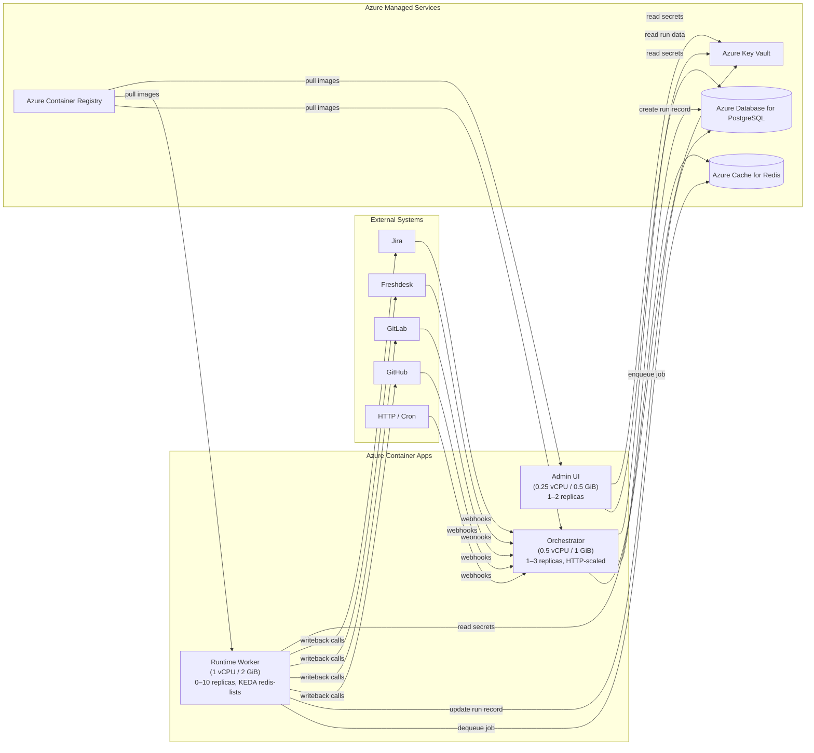
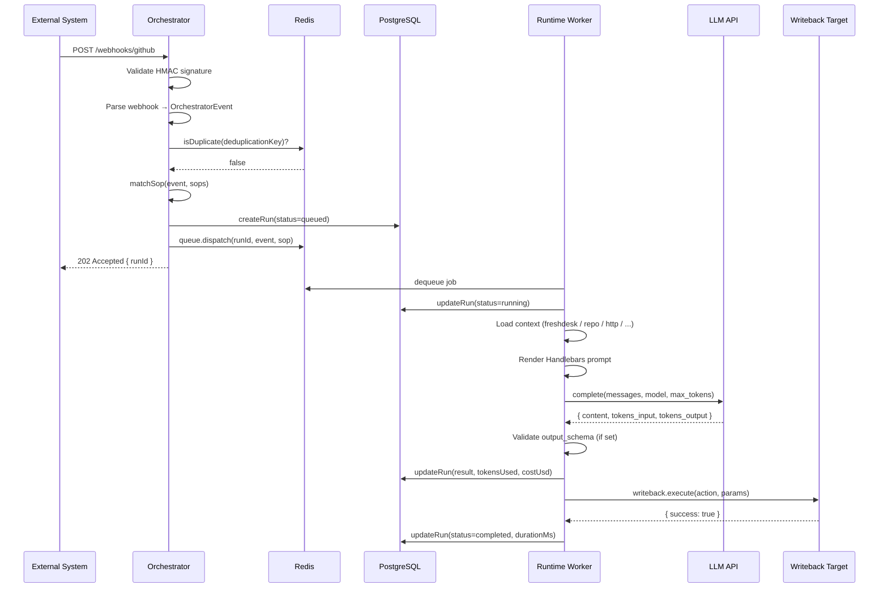

# Architecture

This document describes the system design of the Via Unita AI Orchestration Layer: its components, the data flow from webhook to writeback, and the design principles that govern it.

---

## System Overview



All three Container Apps share a single **User-Assigned Managed Identity** with:
- `AcrPull` role on the Container Registry
- `Key Vault Secrets User` role on the Key Vault

---

## Layers

### Layer 1: Trigger Adapters

Each external system sends webhooks to `POST /webhooks/:adapterType` on the Orchestrator. The adapter for that type:

1. Validates the request signature (HMAC for GitHub, token header for GitLab/Jira, optional shared secret for Freshdesk and HTTP).
2. Parses the raw HTTP request into a normalized `OrchestratorEvent`.

The `OrchestratorEvent` schema is the universal event contract across the entire system:

```typescript
interface OrchestratorEvent {
  id: string;              // UUID, generated at parse time
  source: string;          // "github" | "gitlab" | "freshdesk" | "jira" | "http" | "schedule"
  sourceEventId: string;   // ID from the upstream system
  type: string;            // Normalized event type, e.g. "pr.opened", "ticket.created"
  timestamp: string;       // ISO-8601
  payload: Record<string, unknown>;  // Source-specific fields
  meta: {
    tenant: string;
    triggeredBy?: string;
    deduplicationKey: string;
    interactive: boolean;
  };
}
```

The Schedule adapter works differently: it runs `node-cron` inside the Orchestrator and emits events directly to the SOP router on the configured cron schedule.

### Layer 2: Orchestrator

The Orchestrator is a [Hono](https://hono.dev/) HTTP server (`packages/orchestrator`). After receiving a parsed event it:

1. **Deduplicates** the event using Redis (`deduplicationKey` from the event `meta`). Duplicate events within the TTL window are rejected with HTTP 400.
2. **Routes** the event to a SOP. The router iterates the loaded SOPs and returns the first one where:
   - `trigger.source` contains the event's `source`
   - `trigger.type` contains the event's `type`
   - All `trigger.filter` conditions match fields in `event.payload`
3. **Creates a run record** in PostgreSQL with status `queued`.
4. **Dispatches a BullMQ job** to Redis with the run ID, event, SOP definition, and config path.

The Orchestrator also exposes two API endpoints for direct (non-webhook) invocation:

- `POST /api/run` — async dispatch, returns immediately with the `runId`
- `POST /api/chat` — synchronous dispatch with polling, waits up to `timeoutMs` for completion (default 30 s), intended for OpenWebUI tool integration

Both `/api/*` endpoints require a `Bearer <api-key>` header.

### Layer 3: Execution Runtime

The Runtime Worker (`packages/runtime`) is a BullMQ consumer. For each job it:

1. Updates the run record to `running`.
2. **Loads context** by invoking each configured `ContextLoader` in sequence. Loaders fetch data from external APIs or the local filesystem and return a keyed result that is merged into the Handlebars template context.
3. **Executes steps** sequentially. For each step:
   - Renders the Handlebars prompt template with `event`, `meta`, context loader results, and `previous_step` (output of the previous step, if any).
   - Calls the LLM (Anthropic or OpenAI) with the rendered prompt.
   - If `output_schema` is set on the step, validates the JSON response against the schema. On failure, retries up to `guardrails.max_retries` times, sending the validation error back to the model.
4. **Accumulates token counts** and calculates an estimated cost in USD.
5. Updates the run record to `completed` with the result, token count, cost, and duration.
6. **Executes writebacks** in sequence, passing the final step result and the original event as parameters.

A run-level timeout (`guardrails.timeout_seconds`, default 300 s) races against the entire `processRun` execution. If it expires the run is marked `failed`.

### Layer 4: Writeback Adapters

Writeback adapters (`packages/adapters/src/writebacks`) implement a simple interface:

```typescript
interface WritebackAdapter {
  type: string;
  allowedActions: string[];
  execute(action: WritebackAction): Promise<WritebackResult>;
}
```

Each adapter has a fixed `allowedActions` list. The runtime checks the requested action against this list before calling `execute`. This is the **conservative writeback principle**: adapters can only perform pre-approved, narrowly scoped write operations.

### Layer 5: Observability and Admin

The Admin service (`packages/admin`) provides:

- A Hono JSON API at `/admin/*` (Bearer-auth protected) for querying run history, aggregated stats, and loaded SOPs.
- A React single-page app served from `/` for the browser dashboard.

All run data (status, token usage, cost, duration, trigger event, result) is stored in PostgreSQL and queryable via the admin API.

---

## Data Flow: Webhook to Writeback



---

## Key Design Principles

### Conservative Writeback

The system never performs write operations it was not explicitly configured to do. Each writeback adapter publishes an `allowedActions` list at compile time. A SOP can only trigger actions on that list. No adapter can be coerced into performing an undeclared operation.

The Email adapter enforces an additional constraint: it requires `require_human_approval: true` in the SOP guardrails, or it will refuse to send.

### SOPs as YAML

All automation logic lives in versioned YAML files in the `sops/` directory. There is no automation logic in application code. This means:

- SOPs can be reviewed and audited in pull requests.
- Rolling back an automation change is a `git revert`.
- Non-engineers can read and propose SOP changes without understanding TypeScript.

### Prompts as Artifacts

Prompt templates are stored as `.md` files in `prompts/` and are loaded at runtime from the filesystem. Prompts are versioned alongside SOPs, not inlined into application code. This allows prompt engineers to iterate on prompts independently of service deployments.

### Repository as Stability Anchor

The Git repository is the source of truth for all automation behaviour. The running services are stateless with respect to SOP and prompt content — they load files at startup. Updating behaviour requires updating the repository and redeploying (or re-seeding), not patching a database.

### Schema-Validated Outputs

When a SOP step declares `output_schema`, the runtime validates the LLM response against that JSON schema before accepting it. Failed validation triggers an automatic retry loop (up to `max_retries`), and the validation error is sent back to the model as context, enabling self-correction.
